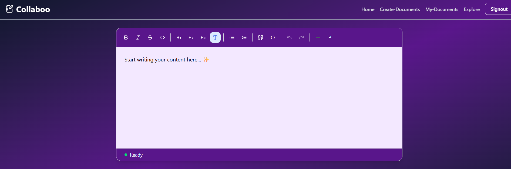

# Colaboo/NexusDocs: A Collaborative AI-Powered Content Co-creation Studio (Still in Progress)


### ✨ Key Features

* **Real-time Collaborative Editing:** Multiple users can edit the same document simultaneously with live cursor tracking and presence indicators, powered by a dedicated WebSocket server and **Conflict-Free Replicated Data Types (Yjs)**.
* **AI-Powered Assistant:** Seamlessly integrated with the **Google Gemini API** to provide an in-editor assistant for content generation, summarization, and tone-based text refinement.
* **Robust Document Management:** Users can create, delete, and manage documents with full role-based access control (owner, editor, viewer).
* **Version History & Rollback:** All document changes are periodically saved to a secure database, allowing users to browse a complete history of the document and roll back to any previous version.
* **Modern Full-Stack Architecture:** Built on the latest **Next.js App Router** and **Server Actions** for a performant, type-safe, and streamlined developer experience.
* **Secure Authentication:** User authentication is handled via **NextAuth.js**, providing a robust and easy-to-use login system with support for third-party providers like Google.

---

### 💻 Technical Stack

**Frontend & Backend:**
* **Next.js (App Router):** The full-stack framework for the application.
* **Express:** For websocket server and yjs server side.
* **TypeScript:** For type safety across the entire codebase.
* **Tailwind CSS:** For fast and efficient styling.

**Real-time & State Management:**
* **Yjs:** The core library for collaborative editing, using CRDTs to manage shared state.
* **`y-quill`:** The binding that connects the Yjs data model to the Quill rich text editor.
* **Socket.IO:** A robust library for real-time, event-based communication between clients and the server.
* **TipTap.js:** A powerful, API-driven rich text editor.

**Database & ORM:**
* **PostgreSQL:** A powerful relational database for storing all application data.
* **Prisma:** A modern ORM for type-safe database access and migrations.

**Authentication & APIs:**
* **NextAuth.js (`@auth/nextjs`):** The full-stack authentication solution for Next.js.
* **Google Gemini API:** The large language model (LLM) used for all AI-powered features.

---


#To get a local copy up and running, follow these steps:

#### Prerequisites
* [Node.js](https://nodejs.org/) (v18 or higher)
* [PostgreSQL](https://www.postgresql.org/)

#### 1. Clone the repository
```bash
git clone [Your Repository URL]
cd my-collab-studio
```
# 📸 Screenshots

### Signin Page


### Landing Page


### Documents Dashboard Page


### Editor Page

